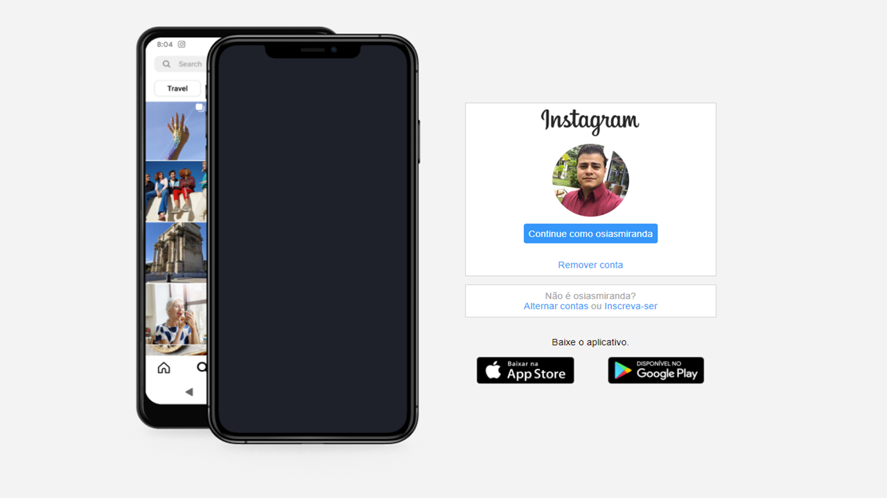

<h1 align="center"> 
	  CLONE INSTAGRAM - Spread Fullstack Developer
</h1>
<div align="center">
 
</div>

## 💻 Sobre o projeto

CloneInstagram- É um projeto para colocar em prática os conhecimentos adquiridos no módulo II - HTML/CSS3.

Projeto desenvolvido no treinamento **Spread Fullstack Developer** oferecido pela [Dio](https://www.dio.me/).

---

## 🛠 Tecnologias

- [x] HTML 5 / CSS3

---

## 🎨 **Layout**

projeto desenvolvido módulo Html/css:



---

## ⚙️ **Pré-requisitos**

- [x] Você precisa do VSCode e extensão do Golive.

## 🚀 **Como executar o projeto**

```bash
# Clone este repositório
 https://github.com/osiasmiranda/bootCampSpread.git

# Executar o arquivo
$ Go Live


# O projeto inciará na porta:3000 - acesse http://localhost:3000
```

## 🦸‍♂️ **Autor**

<a href="https://github.com/osiasmiranda">
 
 <br />
 <sub><b>Osias Miranda</b></sub></a> <a href="https://github.com/osiasmiranda" title="githubosias">🚀</a>

Feito com ❤️ por Osias Miranda 👋🏽 Entre em contato!

[](https://www.linkedin.com/in/osias-miranda-57b67a4b/)
[](mailto:osiasmiranda@gmail.com)

---

## 📝 Licença


Este projeto esta sobe a licença [MIT](./LICENSE).
